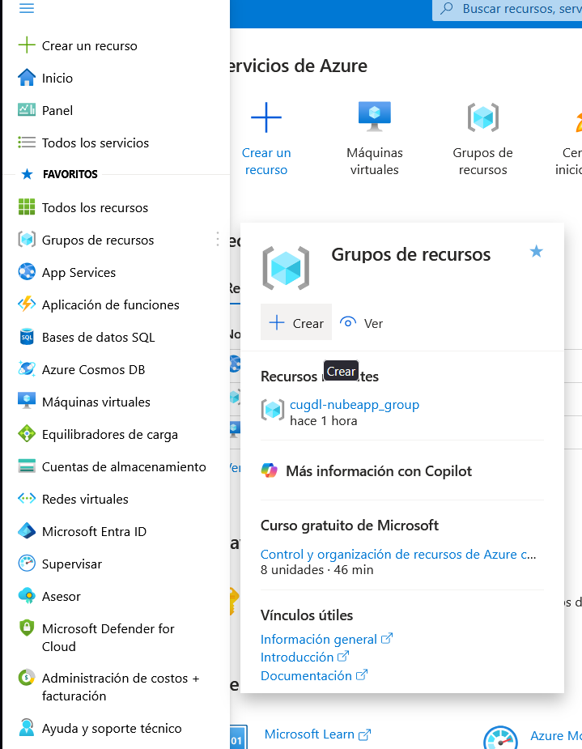
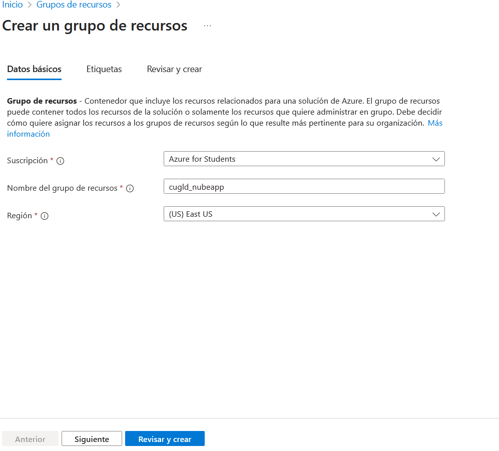
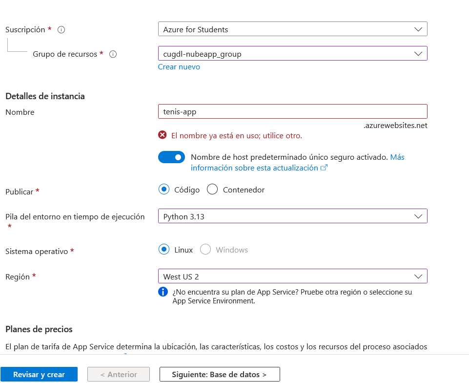
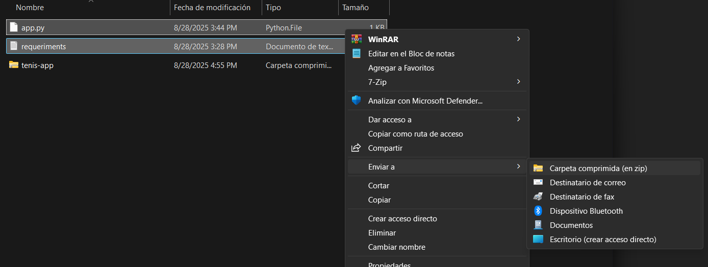
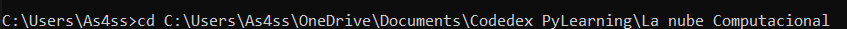
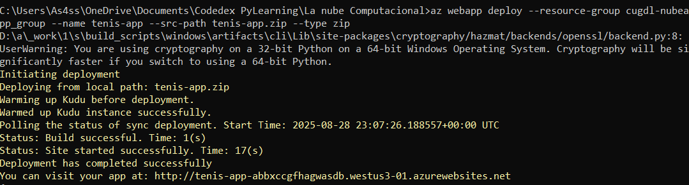
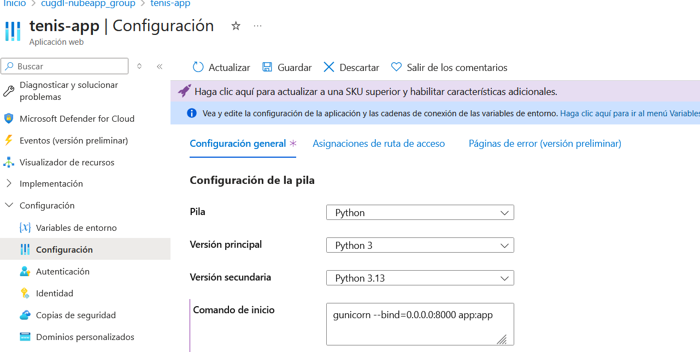
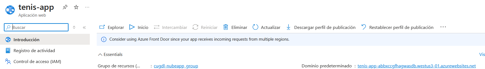
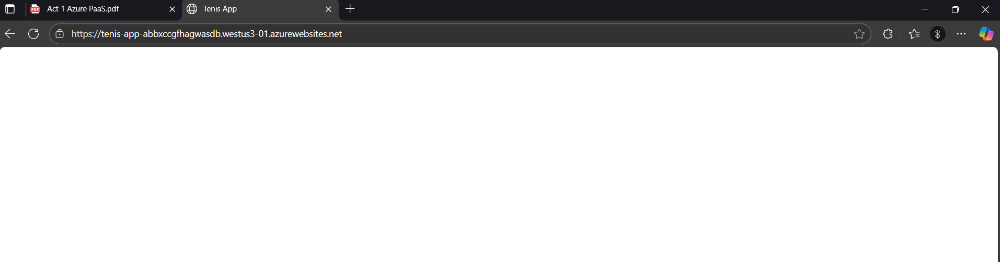

# 🚀 Desplegar una Aplicación Web Python en Azure App Service (PaaS)

Esta guía te enseñará paso a paso cómo desplegar una aplicación web Python (Flask) en Microsoft Azure utilizando el modelo Platform as a Service (PaaS) con Azure App Service.

## 📋 Tabla de Contenidos

1. [Prerrequisitos](#prerrequisitos)
2. [Creación de Cuenta Azure](#1-creación-de-cuenta-azure)
3. [Crear un Grupo de Recursos](#2-crear-un-grupo-de-recursos)
4. [Crear Aplicación Web](#3-crear-aplicación-web)
5. [Preparar la Aplicación Local](#4-preparar-la-aplicación-local)
6. [Despliegue con ZIP Deploy](#5-despliegue-rápido--zip-deploy-método-directo)
7. [Configurar Startup Command](#6-configurar-startup-command)
8. [Verificar el Despliegue](#7-verificar-el-despliegue)
9. [Gestión de Recursos](#8-gestión-de-recursos)

## 📚 Prerrequisitos

Antes de comenzar, asegúrate de tener:

- ✅ Una cuenta de correo institucional o personal
- ✅ Acceso a Microsoft Azure (cuenta gratuita o de estudiante)
- ✅ Azure CLI instalado en tu máquina local
- ✅ Python 3.x instalado
- ✅ Conocimientos básicos de Flask
- ✅ Editor de código (VS Code, PyCharm, etc.)

## 1. Creación de Cuenta Azure

Luego de crear tu cuenta con tu correo institucional y activar el Multi-Factor Authentication (MFA), procederemos con la creación de un grupo de recursos en Azure.



> 💡 **Tip**: Si eres estudiante, puedes aprovechar los créditos gratuitos de Azure for Students que incluye $100 USD en créditos.

## 2. Crear un Grupo de Recursos

Un grupo de recursos es un contenedor lógico para los recursos relacionados en Azure.

### Pasos para crear el grupo de recursos:

1. **Acceder al menú de Grupos de Recursos**
   - Ve al menú lateral izquierdo en el portal de Azure
   - Selecciona "Grupos de recursos"
   - Haz clic en **"Crear"**



2. **Configurar el grupo de recursos**
   - **Nombre**: Asigna un nombre descriptivo (ej: `cugdl-nubeapp_group`)
   - **Región**: Selecciona una región cercana a tu ubicación
   - Haz clic en **"Revisar y crear"** → **"Crear"**


## 3. Crear Aplicación Web

Ahora crearemos el servicio de aplicación web donde hospedaremos nuestra aplicación Python.

### Configuración de App Service:

1. **Crear nuevo recurso**
   - Ve a **"Create a resource"** 
   - Busca **"App Service"** 
   - Haz clic en **"Create"**



2. **Configuración básica**:
   - **Subscription**: Selecciona tu suscripción de estudiante
   - **Resource group**: Selecciona el grupo creado anteriormente (`cugdl_nubeapp_group`)
   - **Name**: Nombre global único (ej: `tenis-app`)
   - **Publish**: Code
   - **Runtime stack**: Python 3.x
   - **Operating System**: Linux
   - **Region**: La misma que el Resource Group o la más conveniente
   - **SKU and size (App Service plan)**: 
     - F1 (Free) para pruebas básicas
     - B1 (Basic) para mayor estabilidad

3. **Finalizar creación**
   - Haz clic en **"Review + create"**
   - Luego en **"Create"**
   - Espera a que termine la implementación
   

## 4. Preparar la Aplicación Local

Ahora prepararemos los archivos necesarios para nuestra aplicación Flask.

### Estructura del proyecto:

Crea una carpeta para tu proyecto y dentro de ella, crea los siguientes archivos:

#### 📄 `app.py`

```python
from flask import Flask 
app = Flask(__name__) 

@app.route("/") 
def home(): 
    return """ 
    <!DOCTYPE html> 
    <html> 
    <head> 
        <title>Tenis App</title> 
        <style>
            body { 
                font-family: Arial, sans-serif; 
                text-align: center; 
                margin: 50px; 
                background-color: #f0f8ff;
            }
            h1 { color: #333; }
            .container { 
                max-width: 600px; 
                margin: 0 auto; 
                padding: 20px;
                background-color: white;
                border-radius: 10px;
                box-shadow: 0 4px 6px rgba(0,0,0,0.1);
            }
        </style>
    </head> 
    <body>
        <div class="container">
            <h1>🎾 Bienvenido a Tenis App</h1>
            <p>¡Tu aplicación Python está funcionando correctamente en Azure!</p>
            <p>Desplegado con Azure App Service (PaaS)</p>
        </div>
    </body>
    </html> 
    """ 

if __name__ == "__main__": 
    app.run(host="0.0.0.0", port=5500, debug=True)
```


#### 📄 `requirements.txt`

```txt
flask==3.0.3 
gunicorn==20.1.0
```


> ⚠️ **Nota importante**: El archivo debe llamarse `requirements.txt` (no `requeriments.txt` como aparece en algunos archivos del proyecto)

### Estructura final del proyecto:
```
tu-proyecto/
├── app.py
├── requirements.txt
└── (otros archivos opcionales)
```

## 5. Despliegue rápido — ZIP deploy (método directo)

Este método permite desplegar tu aplicación directamente desde un archivo ZIP.

### Pasos para el despliegue:

1. **Crear archivo ZIP**
   - Selecciona los archivos `app.py` y `requirements.txt`
   - Crea un archivo ZIP con ambos archivos
   - Nombra el archivo (ej: `tenis-app.zip`)
     


2. **Instalar y configurar Azure CLI**
   - Descarga e instala [Azure CLI](https://docs.microsoft.com/en-us/cli/azure/install-azure-cli)
   - Abre una terminal/símbolo del sistema
   - Ejecuta: `az login`
   - Sigue las instrucciones para autenticarte

3. **Realizar el despliegue**
   - Navega al directorio donde tienes el archivo ZIP
     
   - Ejecuta el siguiente comando:

```bash
az webapp deploy --resource-group cugdl-nubeapp_group --name tenis-app --src-path tenis-app.zip --type zip
```



4. **Verificar el despliegue**
   - Si el comando muestra "Deployment has completed successfully", el despliegue fue exitoso
   - Puedes verificar el estado en el portal de Azure


## 6. Configurar Startup Command

Para que Azure sepa cómo ejecutar tu aplicación Flask, necesitas configurar el comando de inicio.

### Configuración del comando de inicio:

1. **Acceder a configuración**
   - Ve a tu App Service en el portal de Azure
   - En el menú lateral, selecciona **"Configuration"**
   - Ve a la pestaña **"General settings"**

2. **Establecer Startup Command**
   - En el campo **"Startup Command"**, pega lo siguiente:
   ```bash
   gunicorn --bind=0.0.0.0:8000 app:app
   ```
   


   - Haz clic en **"Save"** (Guardar)


> 📝 **Explicación del comando**:
> - `gunicorn`: Servidor WSGI para aplicaciones Python
> - `--bind=0.0.0.0:8000`: Vincula la aplicación al puerto 8000
> - `app:app`: Especifica el archivo (`app.py`) y la instancia de Flask (`app`)

## 7. Verificar el Despliegue

Una vez completada la configuración, es hora de verificar que tu aplicación esté funcionando correctamente.

### Acceder a tu aplicación:

1. **Obtener la URL**
   - Ve a la página **"Overview"** de tu App Service
   - Busca el **"Default domain"** o **"URL"**
   - Copia la URL o haz clic directamente en ella


2. **Verificar funcionamiento**
   - La aplicación debería cargar mostrando tu página de bienvenida
   - Si hay errores, revisa los logs en **"Log stream"** en el portal de Azure
     
     

## 8. Gestión de Recursos

### 🛑 Importante: Gestión de costos

Para evitar consumir créditos innecesariamente:

1. **Detener la aplicación cuando no la uses**:
   - Ve a tu App Service
   - Haz clic en **"Stop"** en la barra superior
   - Esto pausará la aplicación sin eliminar la configuración

2. **Monitorear el uso de recursos**:
   - Revisa regularmente tu consumo en **"Cost Management + Billing"**
   - Configura alertas de gasto si es necesario

3. **Eliminar recursos cuando termines**:
   - Si ya no necesitas la aplicación, elimina todo el grupo de recursos
   - Esto eliminará todos los recursos asociados y detendrá cualquier facturación


## 🎉 ¡Felicitaciones!

Has desplegado exitosamente tu aplicación Python Flask en Azure App Service. Tu aplicación ahora está disponible en la nube y puede ser accedida desde cualquier lugar del mundo.

### 🔧 Próximos pasos sugeridos:

- Configura un dominio personalizado
- Implementa HTTPS/SSL
- Configura CI/CD con GitHub Actions
- Añade una base de datos (Azure SQL Database o Cosmos DB)
- Implementa autenticación de usuarios
- Configura múltiples entornos (desarrollo, pruebas, producción)

### 📚 Recursos adicionales:

- [Documentación oficial de Azure App Service](https://docs.microsoft.com/en-us/azure/app-service/)
- [Tutorial de Flask en Azure](https://docs.microsoft.com/en-us/azure/app-service/quickstart-python)
- [Azure CLI Reference](https://docs.microsoft.com/en-us/cli/azure/webapp)

---

**Autor**: Miguel Zuñiga  
**Fecha**: Agosto 2025  
**Versión**: 2.0

> 💡 **¿Necesitas ayuda?** Si encuentras algún problema durante el despliegue, revisa los logs de la aplicación en el portal de Azure o consulta la documentación oficial de Microsoft Azure.
